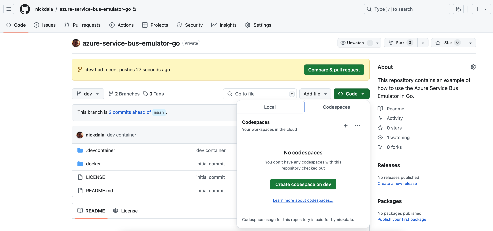

# Azure Service Bus Emulator Example in GO

This repository contains an example of how to use the [Azure Service Bus Emulator](https://learn.microsoft.com/azure/service-bus-messaging/test-locally-with-service-bus-emulator) in [Go](https://go.dev/). The emulator allows you to develop and test your applications locally without needing to connect to the actual Azure Service Bus service.

This example demonstrates how to send and receive messages from a queue using the Azure SDK for Go. A secondary objective is to show how to use [Protocol Buffers](https://protobuf.dev/) (or protobuf) to encode the payload of the
Azure Service Bus message. For more information on best practices for message encoding, see the [Message encoding considerations documentation](https://learn.microsoft.com/en-us/azure/architecture/best-practices/message-encode).

## Prerequisites

- Docker installed on your machine.
- Go installed on your machine.

**Note:** There is a [Dev Container](https://code.visualstudio.com/docs/remote/containers) that can be used to build the project in a container. This is useful if you don't have Go installed on your machine. You can open the project in Visual Studio Code and select the "Reopen in Container" option. Or you can use [CodeSpaces](https://github.com/features/codespaces) to build the project in the cloud.



## Getting Started

1. Clone the repository:

```bash
git clone https://github.com/nickdala/azure-service-bus-emulator-go

cd azure-service-bus-emulator-go
```

2. Run the Docker container for the Azure Service Bus Emulator:

```bash
docker compose -f ./docker/docker-compose.yaml up -d
```

**Note:** To change the SQL password, edit the `./docker/.env` file and set *MSSQL_SA_PASSWORD* to a secure password per [Microsoft's documentation](https://learn.microsoft.com/sql/relational-databases/security/strong-passwords?view=sql-server-linux-ver16).

3. Verify that the Docker container is running:

```bash
docker ps
```

You should see something like the following:

```
vscode ➜ /workspaces/azure-service-bus-emulator-go $ docker ps
CONTAINER ID   IMAGE                                                          COMMAND                  CREATED          STATUS         PORTS                                                 NAMES
de1d403a5e9c   mcr.microsoft.com/azure-messaging/servicebus-emulator:latest   "/ServiceBus_Emulato…"   13 minutes ago   Up 5 seconds   0.0.0.0:5672->5672/tcp, :::5672->5672/tcp, 8080/tcp   servicebus-emulator
da806c13de70   mcr.microsoft.com/azure-sql-edge:latest                        "/opt/mssql/bin/perm…"   13 minutes ago   Up 6 seconds   1401/tcp, 1433/tcp                                    sqledge
```

4. Build the project:

```bash
go build
```

## Running the Example

After building the project, you can run the following command to get an idea of the options available:

```bash
./azure-service-bus-emulator-go --help
```

You should see a *produce* and *consume* command that you can use to send and receive messages from the Azure Service Bus queue.:

```
azure-service-bus-emulator-go is a CLI tool to interact with Azure Service Bus Emulator.

Usage:
  azure-service-bus-emulator-go [command]

Available Commands:
  completion  Generate the autocompletion script for the specified shell
  consume     consume receives messages from Azure Service Bus Emulator
  help        Help about any command
  produce     produce generates messages to Azure Service Bus Emulator

Flags:
  -h, --help     help for azure-service-bus-emulator-go
  -t, --toggle   Help message for toggle

Use "azure-service-bus-emulator-go [command] --help" for more information about a command.
```

### Produce

To send a message to the Azure Service Bus queue, run the following command:

```bash
./azure-service-bus-emulator-go produce -p cat -n whiskers
```

Lets send a couple more messages:

```bash
./azure-service-bus-emulator-go produce -p dog -n fido

./azure-service-bus-emulator-go produce -p bird -n tweety

./azure-service-bus-emulator-go produce -p fish -n nemo
```

At this point, you should have four messages in the Azure Service Bus queue.

### Consume

To receive messages from the Azure Service Bus queue, run the following command:

```bash
./azure-service-bus-emulator-go consume
```

You should see the following output:

```
consume called
There are at least 5 messages in the queue
Pet type: PET_TYPE_CAT Pet name: whiskers
```

Run the command again to receive the next message until all messages have been consumed:

```bash
./azure-service-bus-emulator-go consume
consume called
There are at least 3 messages in the queue
Pet type: PET_TYPE_DOG Pet name: fido

./azure-service-bus-emulator-go consume
consume called
There are at least 2 messages in the queue
Pet type: PET_TYPE_BIRD Pet name: tweety

./azure-service-bus-emulator-go consume
consume called
There are at least 1 messages in the queue
Pet type: PET_TYPE_FISH Pet name: nemo

./azure-service-bus-emulator-go consume
consume called
There are at least 0 messages in the queue
No messages in the queue. Exiting...
```

## Teardown

To stop and remove the Docker container, run:

```bash
docker compose -f ./docker/docker-compose.yaml down
```

To remove any volumes created by the Docker container, run:

```bash
docker compose -f ./docker/docker-compose.yaml down -v
```

## License

This project is licensed under the MIT License. See the LICENSE file for details.

## Acknowledgments

- [Azure SDK for Go](https://github.com/Azure/azure-sdk-for-go) for interacting with Azure services.
- [Azure Service Bus Emulator](https://learn.microsoft.com/en-us/azure/service-bus-messaging/overview-emulator) for local development and testing.

Feel free to fork this repository and make it your own!
